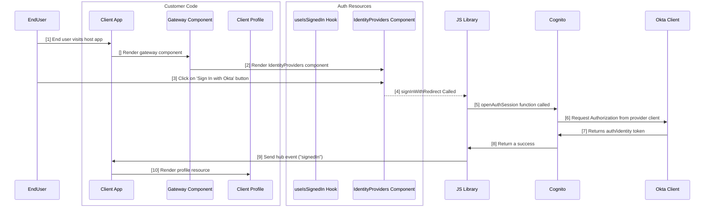

```mermaid
sequenceDiagram
    participant EndUser
    box Customer Code
    participant Client App
    participant Gateway Component
    participant Client Profile
    end
    box Auth Resources
    participant useIsSignedIn Hook
    participant IdentityProviders Component
    end
    participant JS Library
    EndUser->>Client App: [1] End user visits host app
    Client App->>Gateway Component: [] Render gateway component
    Gateway Component->>IdentityProviders Component: [2] Render IdentityProviders component
    EndUser->>IdentityProviders Component: [3] Click on 'Sign In with Okta' button
    IdentityProviders Component-->>JS Library: [4] signInWithRedirect Called
    JS Library->>Cognito: [5] openAuthSession function called
    Cognito->>Okta Client: [6] Request Authorization from provider client
    Okta Client->>Cognito: [7] Returns auth/identity token
    Cognito->>JS Library: [8] Return a success
    JS Library->>Client App: [9] Send hub event ("signedIn")
    
    Client App->>Client Profile: [10] Render profile resource
```