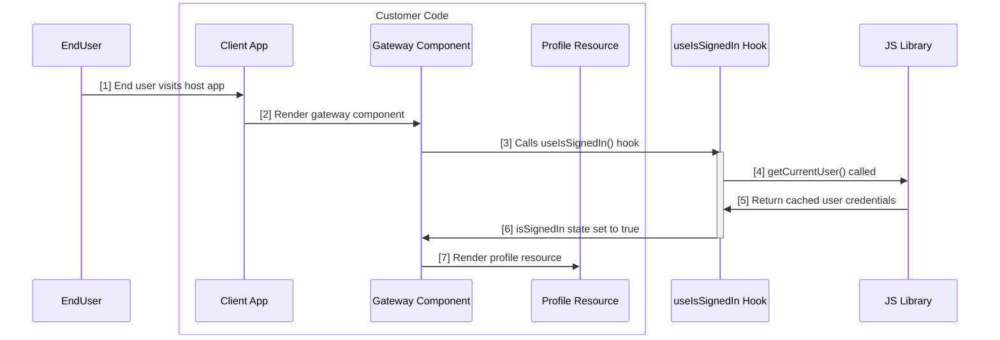

```mermaid
sequenceDiagram
    participant EndUser
    box Customer Code
    participant Client App
    participant Gateway Component
    participant Profile Resource
    end
    EndUser->>Client App: [1] End user visits host app
    participant useIsSignedIn Hook
    Client App->> Gateway Component: [2] Render gateway component
    Gateway Component->>useIsSignedIn Hook: [3] Calls useIsSignedIn() hook
    activate useIsSignedIn Hook
    useIsSignedIn Hook->>JS Library: [4] getCurrentUser() called
    JS Library->>useIsSignedIn Hook: [5] Return cached user credentials
    useIsSignedIn Hook->>Gateway Component: [6] isSignedIn state set to true
    deactivate useIsSignedIn Hook
    Gateway Component->> Profile Resource: [7] Render profile resource
```
