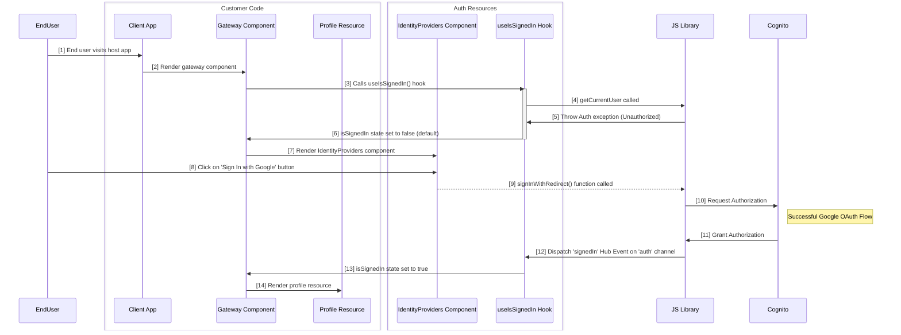

```mermaid
sequenceDiagram
    participant EndUser
    box Customer Code
    participant Client App
    participant Gateway Component
    participant Profile Resource
    end
    EndUser->>Client App: [1] End user visits host app
    box Auth Resources
    participant IdentityProviders Component
    participant useIsSignedIn Hook
    end
    Client App->> Gateway Component: [2] Render gateway component
    Gateway Component->>useIsSignedIn Hook: [3] Calls useIsSignedIn() hook
    activate useIsSignedIn Hook
    useIsSignedIn Hook->>JS Library: [4] getCurrentUser called
    JS Library->>useIsSignedIn Hook: [5] Throw Auth exception (Unauthorized)
    useIsSignedIn Hook->>Gateway Component: [6] isSignedIn state set to false (default)
    deactivate useIsSignedIn Hook
    Gateway Component->>IdentityProviders Component: [7] Render IdentityProviders component
    EndUser->>IdentityProviders Component: [8] Click on 'Sign In with Google' button
    IdentityProviders Component-->>JS Library: [9] signInWithRedirect() function called
    JS Library->>Cognito: [10] Request Authorization
    Note right of Cognito: Successful Google OAuth Flow
    Cognito->>JS Library: [11] Grant Authorization
    JS Library->>useIsSignedIn Hook: [12] Dispatch 'signedIn' Hub Event on 'auth' channel
    useIsSignedIn Hook->>Gateway Component: [13] isSignedIn state set to true
    Gateway Component->>Profile Resource: [14] Render profile resource
```
