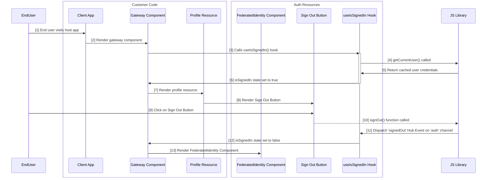

```mermaid
sequenceDiagram
    participant EndUser
    box Customer Code
    participant Client App
    participant Gateway Component
    participant Profile Resource
    end
    EndUser->>Client App: [1] End user visits host app
    box Auth Resources
    participant FederatedIdentity Component
    participant Sign Out Button
    participant useIsSignedIn Hook
    end
    Client App->> Gateway Component: [2] Render gateway component
    Gateway Component->>useIsSignedIn Hook: [3] Calls useIsSignedIn() hook
    activate useIsSignedIn Hook
    useIsSignedIn Hook->>JS Library: [4] getCurrentUser() called
    JS Library->>useIsSignedIn Hook: [5] Return cached user credentials
    useIsSignedIn Hook->>Gateway Component: [6] isSignedIn state set to true
    deactivate useIsSignedIn Hook
    Gateway Component->> Profile Resource: [7] Render profile resource
    Profile Resource->> Sign Out Button: [8] Render Sign Out Button
    EndUser->>Sign Out Button: [9] Click on Sign Out Button
    Sign Out Button-->>JS Library: [10] signOut() function called
    JS Library->>useIsSignedIn Hook: [11] Dispatch 'signedOut' Hub Event on 'auth' channel
    useIsSignedIn Hook->>Gateway Component: [12] isSignedIn state set to false
    Gateway Component->>FederatedIdentity Component: [13] Render FederatedIdentity Component

```